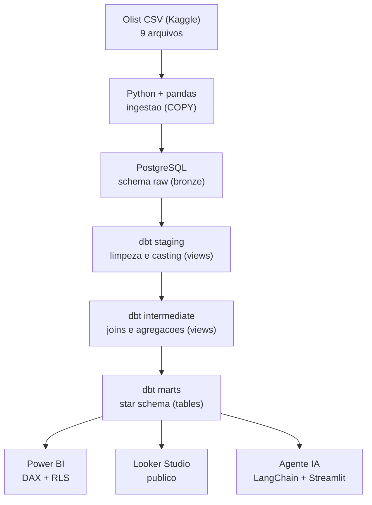
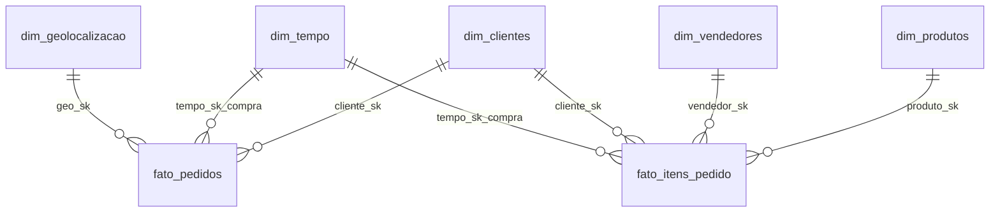

# Pipeline de Dados Operacionais do Varejo Brasileiro (Olist)

Pipeline de dados de ponta a ponta sobre o e-commerce brasileiro, usando o dataset publico da Olist (~100 mil pedidos reais). O projeto vai da ingestao dos CSVs ate um modelo dimensional testado, servindo BI (Power BI e Looker Studio) e um agente de IA que responde perguntas em linguagem natural.

O objetivo e mostrar, na pratica, a stack de engenharia e analytics engineering mais pedida no mercado brasileiro: **Python, SQL, dbt, PostgreSQL, Docker, PySpark, Airflow e Power BI**.

> Status atual: **Fase 1 (base local) concluida e testada.** As fases 2 a 6 estao detalhadas no [ROADMAP.md](ROADMAP.md) e serao entregues uma por commit.

---

## 1. Problema de negocio

A Olist conecta pequenos lojistas aos grandes marketplaces do Brasil. Cada venda gera dados espalhados em varias tabelas (pedidos, itens, pagamentos, avaliacoes, clientes, vendedores, geolocalizacao). Sem um modelo central, cada pergunta de negocio vira um SQL manual e demorado.

Este pipeline organiza esses dados em um **modelo dimensional (star schema)** para responder rapido perguntas como:

- Qual regiao e estado mais vende? Qual o ticket medio por regiao?
- Quais vendedores e categorias tem melhor desempenho?
- Quanto tempo leva a entrega e qual o percentual de atraso?
- A nota de avaliacao cai quando o pedido atrasa?

### Alguns numeros ja extraidos do modelo

| Indicador | Valor |
|---|---|
| Pedidos processados | 99.441 |
| Receita total (itens + frete) | R$ 15,84 milhoes |
| Ticket medio por pedido | R$ 159,33 |
| Tempo medio de entrega | 12,5 dias |
| Pedidos entregues no prazo | 93,2% |
| Nota media de avaliacao | 4,07 de 5 |
| Estado lider em receita | Sao Paulo (R$ 5,9 mi) |
| Categoria lider em receita | health_beauty (R$ 1,44 mi) |

---

## 2. Arquitetura



O fluxo segue o padrao **Medallion** (bronze / silver / gold), que na fase cloud vira Bronze, Silver e Gold no Databricks:

- **raw (bronze):** dado como veio do CSV, tudo em texto. Nada de transformacao aqui. Se algo der errado depois, o bruto continua intacto para reprocessar.
- **staging + intermediate (silver):** limpeza, conversao de tipos, joins e agregacoes. Sao views: leves e sempre atualizadas.
- **marts (gold):** o star schema pronto para consumo. Sao tabelas materializadas, para o BI e o agente responderem rapido.

### Modelo dimensional (marts)

Dois fatos, porque existem dois graos diferentes:

- **fato_pedidos** (um por pedido): metricas de valor, pagamento, nota e entrega.
- **fato_itens_pedido** (um por item): e onde produto e vendedor se conectam, ja que um pedido pode ter varios produtos e vendedores.

Dimensoes: `dim_clientes`, `dim_produtos`, `dim_vendedores`, `dim_tempo`, `dim_geolocalizacao`.



---

## 3. Stack e o porque de cada escolha

| Camada | Ferramenta | Por que |
|---|---|---|
| Ingestao | Python + pandas | Le CSV bagunçado (virgulas e quebras de linha nas avaliacoes) e carrega em massa com `COPY`, muito mais rapido que INSERT. |
| Data lake / raw | PostgreSQL schema `raw` | Na fase local, o proprio Postgres guarda o bruto. Na fase cloud, vira Azure Blob Storage. |
| Transformacao | dbt (dbt-core) | Padrao de mercado para analytics engineering: SQL versionado, testes de qualidade, documentacao e linhagem automatica. |
| Armazenamento | PostgreSQL (Azure SQL na fase cloud) | Banco relacional solido, gratuito e o que a maioria das vagas pede. |
| Orquestracao | Apache Airflow (Docker) | Agendar e monitorar o pipeline diario (fase 3). |
| BI principal | Power BI (DAX, RLS, OLS) | Ferramenta usada no dia a dia da Ambev e muito pedida nas vagas. |
| BI publico | Looker Studio | Dashboard online e gratuito, para portfolio 24/7. |
| IA | LangChain + Streamlit | Perguntas em linguagem natural viram SQL sobre o warehouse. |
| Container | Docker + Docker Compose | Sobe o ambiente inteiro com um comando, em qualquer maquina. |

---

## 4. Como rodar localmente

Pre requisitos: **Docker Desktop** e **Python 3.11+**.

```bash
# 1. Clonar e entrar na pasta
git clone https://github.com/gustavohenriqq/pipeline-olist.git
cd pipeline-olist

# 2. Configurar variaveis (copie o exemplo e ajuste se quiser)
cp .env.example .env

# 3. Baixar o dataset do Kaggle e colocar os 9 CSVs em data/raw/
#    (Brazilian E-Commerce Public Dataset by Olist)

# 4. Instalar as dependencias Python
pip install -r requirements.txt

# 5. Subir o Postgres (e o pgAdmin em http://localhost:8080)
docker compose up -d

# 6. Rodar tudo de uma vez: ingestao + dbt run + dbt test
make pipeline
```

### Rodar rapido, sem baixar o Kaggle (amostra)

O repositorio ja traz uma amostra pequena e coerente em `data/sample/` (800 pedidos, chaves preservadas). Da para rodar o pipeline inteiro so com ela:

```bash
docker compose up -d
OLIST_DATA_DIR=data/sample python ingestion/ingest.py
cd dbt && dbt build --profiles-dir .
```

E exatamente o que o CI (GitHub Actions) roda a cada push. Para o dataset completo, use `data/raw/` como abaixo.

### Passo a passo manual

Sem `make` (Windows puro), rode na ordem:

```bash
docker compose up -d
python ingestion/ingest.py
cd dbt
dbt run  --profiles-dir .
dbt test --profiles-dir .
```

Para ver a documentacao e a linhagem do dbt no navegador:

```bash
cd dbt
dbt docs generate --profiles-dir .
dbt docs serve    --profiles-dir . --port 8081
```

### O que o pipeline entrega ao final

- Schema `raw`: 9 tabelas cruas.
- Schema `staging` e `intermediate`: views de limpeza e agregacao.
- Schema `marts`: 5 dimensoes + 2 fatos, prontos para BI.
- 57 testes de qualidade dbt (unicidade, nao nulo, valores aceitos, integridade referencial e range).

---

## 5. Estrutura do repositorio

```
pipeline-olist/
├── data/raw/                 # CSVs do Kaggle (ignorados no Git)
├── ingestion/                # ingestao Python + pandas
│   ├── config.py             # conexao e mapeamento CSV -> tabela
│   └── ingest.py             # carga em massa via COPY
├── dbt/                      # projeto dbt
│   ├── models/
│   │   ├── staging/          # limpeza e casting (views)
│   │   ├── intermediate/     # joins e agregacoes (views)
│   │   └── marts/            # star schema (tables)
│   ├── macros/               # helpers proprios (surrogate key, calendario, regiao, testes)
│   ├── tests/                # testes singulares
│   ├── dbt_project.yml
│   └── profiles.yml
├── dashboards/               # notas de Power BI e Looker Studio
├── docs/                     # diagramas e decisoes
├── docker-compose.yml        # Postgres + pgAdmin
├── Makefile                  # atalhos (make pipeline, make dbt-run, ...)
├── requirements.txt
└── ROADMAP.md                # plano completo das 6 fases
```

---

## 6. Decisoes tecnicas (o porque, nao so o como)

**Raw em texto puro.** A camada raw guarda tudo como TEXT e nao converte nada. O casting fica no staging do dbt, versionado no Git. Assim, mudar uma regra de conversao e uma alteracao rastreavel, e o dado bruto nunca e perdido.

**COPY em vez de INSERT linha a linha.** A tabela de geolocalizacao tem 1 milhao de linhas. `df.to_sql` seria lento demais. O `COPY` nativo do Postgres carrega tudo em segundos.

**Cliente no grao de pessoa.** Na base do Olist, `customer_id` muda a cada pedido. Quem identifica a pessoa e o `customer_unique_id`. A `dim_clientes` usa a pessoa, senao a contagem de clientes ficaria inflada.

**Dois fatos, dois graos.** Nao da para colocar produto e vendedor no fato de pedido, porque um pedido tem varios. Por isso existe o `fato_itens_pedido` no grao de item. Esse e o jeito certo de star schema quando ha graos diferentes.

**Sem dependencia de pacote externo no dbt.** Em vez do `dbt_utils`, o projeto traz macros proprias (surrogate key, calendario, testes). Assim ele roda em qualquer ambiente, mesmo sem acesso ao hub do dbt. A troca pelo `dbt_utils` e simples se um dia for desejada.

**Testes desde o inicio.** Qualidade de dado nao e opcional. Cada modelo tem testes de unicidade, nao nulo, valores aceitos e integridade referencial. O pipeline so e confiavel se os testes passam.

### O que pode dar problema em producao real

- **Schemas fixos (`staging`, `marts`).** Otimo local, mas num warehouse compartilhado por varios devs isso causa colisao. Em producao, o padrao `<ambiente>_<schema>` (comportamento default do dbt) e mais seguro.
- **Geolocalizacao incompleta.** 278 CEPs de cliente nao existem na base de geolocalizacao. O teste de integridade esta como **aviso**, nao erro, de proposito. Em producao, decidir: enriquecer com outra fonte de CEP ou aceitar o gap.
- **Reprocessamento full.** Hoje a carga refaz tudo. Com volume grande, o certo e carga incremental (models incrementais no dbt e ingestao so do delta).
- **Segredos.** O `.env` nunca vai para o Git. Em producao, usar um cofre de segredos (Azure Key Vault, AWS Secrets Manager).

---

## 7. Dashboards

- **Looker Studio (publico):** link sera adicionado ao final da Fase 1. Conecta direto no Postgres (ou no Neon, Postgres serverless na nuvem, para ficar online 24/7).
- **Power BI (Fase 4):** dashboard executivo com DAX avancado, RLS por regiao e vendedor e OLS para metricas sensiveis.

Prints serao adicionados em `docs/prints/` conforme cada dashboard ficar pronto.

---

## 8. Proximos passos

O plano completo esta no [ROADMAP.md](ROADMAP.md). Resumo:

1. Base local (concluida): ingestao, Postgres, dbt, testes.
2. Cloud Azure: Blob Storage + PySpark no Databricks + Azure SQL.
3. Orquestracao com Airflow (Docker Compose).
4. Power BI avancado (DAX, RLS, OLS).
5. ML basico: previsao de demanda com scikit-learn.
6. Agente de IA com LangChain respondendo em linguagem natural.

---

## Sobre

Projeto de portfolio de **Gustavo Henrique Silva Nascimento**, estudante de Ciencia da Computacao e profissional de dados, focado na trajetoria Analista de Dados, Analytics Engineer e Engenharia de Dados.

GitHub: [@gustavohenriqq](https://github.com/gustavohenriqq) · Dataset: [Brazilian E-Commerce Public Dataset by Olist (Kaggle)](https://www.kaggle.com/datasets/olistbr/brazilian-ecommerce)
