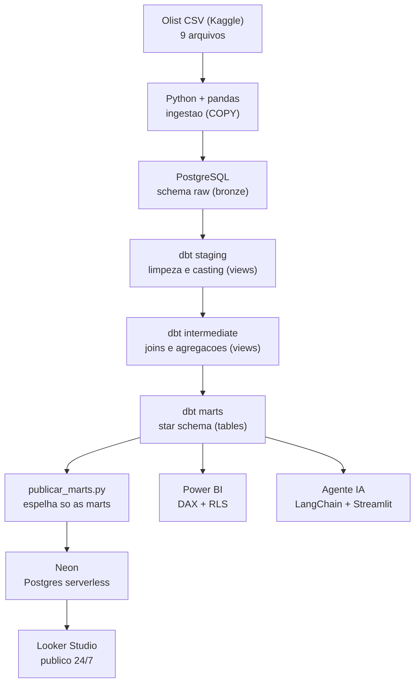
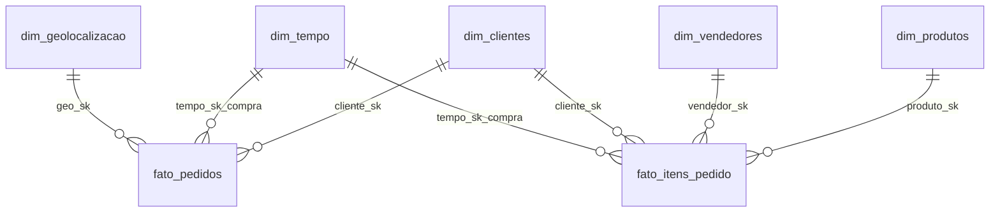

# Atraso na entrega custa R$ 1,15 milhao ao ano

Pipeline de dados de ponta a ponta sobre o e-commerce brasileiro (dataset publico
da Olist, 99.441 pedidos reais), construido para responder uma pergunta de
negocio especifica e agir sobre ela.

## O achado

Atrasar a entrega em uma semana derruba a nota do cliente de **4,29 para 2,72**.
Atrasar entre 8 e 30 dias derruba para **1,65**.

| Situacao da entrega | Pedidos | Nota media |
|---|---|---|
| No prazo | 89.936 | **4,29** |
| Atraso de 1 a 7 dias | 3.672 | 2,72 |
| Atraso de 8 a 30 dias | 2.517 | **1,65** |
| Atraso acima de 30 dias | 345 | 2,06 |

Sao **6.534 pedidos atrasados, R$ 1.150.892 em receita, 7,3% do total**. O atraso
nao se distribui por igual: o Nordeste atrasa **12,7%** dos pedidos contra
**5,9%** do Sul, e venda entre regioes diferentes atrasa 25% mais que venda
dentro da mesma regiao.

## O que o projeto faz com isso

Tres frentes atacam a mesma pergunta, e a conexao entre elas e o ponto do
projeto:

| Frente | Papel | Estado |
|---|---|---|
| **Analise** | Quantificar o problema e recomendar acao | Etapa 2 |
| **Engenharia** | Entregar o dado com confiabilidade, todo dia | Etapas 1 e 3 |
| **ML** | Prever o atraso no momento do pedido | Etapa 4 |

O ciclo fecha quando a previsao do modelo aparece no mesmo dashboard que a
analise usou para achar o problema. O plano completo, incluindo o que foi
descartado e por que, esta no [ROADMAP.md](ROADMAP.md).

> Status: **Etapa 1 (fundacao) concluida e testada** no dataset completo.
> 68 testes de qualidade, 88 PASS e 0 ERROR, rodando no CI a cada push.

Stack: **Python, SQL, dbt, PostgreSQL, Docker, Airflow, scikit-learn e Power BI.**

---

## 1. Problema de negocio

A Olist conecta pequenos lojistas aos grandes marketplaces do Brasil. Cada venda
gera dados espalhados em varias tabelas (pedidos, itens, pagamentos, avaliacoes,
clientes, vendedores, geolocalizacao). Sem um modelo central, cada pergunta de
negocio vira um SQL manual e demorado.

Este pipeline organiza esses dados em um **modelo dimensional (star schema)** que
sustenta tanto o diagnostico quanto a acao:

- Onde o atraso se concentra, e quanto ele custa em receita e em satisfacao?
- Qual regiao e estado mais vende? Qual o ticket medio por regiao?
- Quais vendedores e categorias tem melhor desempenho?
- Da para prever, no ato da compra, que um pedido vai atrasar?

### Numeros do modelo

| Indicador | Valor |
|---|---|
| Pedidos processados | 99.441 |
| Receita total (itens + frete) | R$ 15,84 milhoes |
| Ticket medio por pedido | R$ 159,33 |
| Tempo medio de entrega | 12,5 dias |
| Pedidos entregues no prazo | 93,2% |
| Nota media de avaliacao | 4,09 de 5 |
| Estado lider em receita | Sao Paulo (R$ 5,9 mi) |
| Categoria lider em receita | health_beauty (R$ 1,44 mi) |

Base: dataset completo. O tempo de entrega e o percentual no prazo consideram so
os pedidos ja entregues, porque incluir os 2.963 em transito contaria como
atrasado um pedido que ainda nem venceu o prazo.

---

## 2. Arquitetura



O fluxo segue o padrao **Medallion** (bronze / silver / gold), que na fase cloud vira Bronze, Silver e Gold no Databricks:

- **raw (bronze):** dado como veio do CSV, tudo em texto. Nada de transformacao aqui. Se algo der errado depois, o bruto continua intacto para reprocessar.
- **staging + intermediate (silver):** limpeza, conversao de tipos, joins e agregacoes. Sao views: leves e sempre atualizadas.
- **marts (gold):** o star schema pronto para consumo. Sao tabelas materializadas, para o BI e o agente responderem rapido.

### Modelo dimensional (marts)

Dois fatos, porque existem dois graos diferentes:

- **fato_pedidos** (um por pedido): metricas de valor, pagamento, nota e entrega.
- **fato_itens_pedido** (um por item): e onde produto e vendedor se conectam, ja que um pedido pode ter varios produtos e vendedores.

Dimensoes: `dim_clientes`, `dim_produtos`, `dim_vendedores`, `dim_tempo`, `dim_geolocalizacao`.

Alem do star schema, a camada marts tem duas **tabelas largas (OBT, One Big Table)** derivadas dele: `obt_pedidos` (grao de pedido) e `obt_itens` (grao de item). Elas existem porque o Looker Studio trata cada tabela como fonte separada e so junta por "blend", que e limitado. A tabela larga elimina esse atrito no BI. O star schema continua sendo a fonte da verdade: e nele que os testes de integridade referencial rodam e e nele que o Power BI (Fase 4) e o agente de IA (Fase 6) vao ligar, porque tanto o VertiPaq quanto o texto-para-SQL trabalham melhor com modelo dimensional.



---

## 3. Stack e o porque de cada escolha

| Camada | Ferramenta | Por que |
|---|---|---|
| Ingestao | Python + pandas | Le CSV bagunçado (virgulas e quebras de linha nas avaliacoes) e carrega em massa com `COPY`, muito mais rapido que INSERT. |
| Data lake / raw | PostgreSQL schema `raw` | Na fase local, o proprio Postgres guarda o bruto. Na fase cloud, vira Azure Blob Storage. |
| Transformacao | dbt (dbt-core) | Padrao de mercado para analytics engineering: SQL versionado, testes de qualidade, documentacao e linhagem automatica. |
| Armazenamento | PostgreSQL (Azure SQL na fase cloud) | Banco relacional solido, gratuito e o que a maioria das vagas pede. |
| Orquestracao | Apache Airflow (Docker) | Agendar e monitorar o pipeline diario (fase 3). |
| BI principal | Power BI (DAX, RLS, OLS) | Padrao de mercado em BI corporativo no Brasil. |
| BI publico | Looker Studio | Dashboard online e gratuito, para portfolio 24/7. |
| IA | LangChain + Streamlit | Perguntas em linguagem natural viram SQL sobre o warehouse. |
| Container | Docker + Docker Compose | Sobe o ambiente inteiro com um comando, em qualquer maquina. |

---

## 4. Como rodar localmente

Pre requisitos: **Docker Desktop** e **Python 3.11+**.

```bash
# 1. Clonar e entrar na pasta
git clone https://github.com/gustavohenriqq/pipeline-olist.git
cd pipeline-olist

# 2. Configurar variaveis (copie o exemplo e ajuste se quiser)
cp .env.example .env

# 3. Baixar o dataset do Kaggle e colocar os 9 CSVs em data/raw/
#    (Brazilian E-Commerce Public Dataset by Olist)

# 4. Instalar as dependencias Python (recomendado num ambiente virtual)
python -m venv .venv
source .venv/bin/activate          # Windows: .venv\Scriptsctivate
pip install -r requirements.txt

# 5. Subir o Postgres (e o pgAdmin em http://localhost:8080)
docker compose up -d

# 6. Rodar tudo de uma vez: ingestao + dbt build (models + testes)
make pipeline

# 7. Opcional: publicar as marts no Neon para o Looker Studio ler
#    (preencha antes o bloco NEON_* do .env)
make publicar
```

> **Windows.** Se o `dbt` na linha de comando for bloqueado pela politica de
> Controle de Aplicativo, chame o modulo em vez do executavel:
> `python -m dbt.cli.main build --profiles-dir .`. E o mesmo programa, sem o
> atalho `.exe` que a politica barra.

### Rodar rapido, sem baixar o Kaggle (amostra)

O repositorio ja traz uma amostra pequena e coerente em `data/sample/` (800 pedidos, chaves preservadas). Da para rodar o pipeline inteiro so com ela:

```bash
docker compose up -d
OLIST_DATA_DIR=data/sample python ingestion/ingest.py
cd dbt && dbt build --profiles-dir .
```

E exatamente o que o CI (GitHub Actions) roda a cada push. Para o dataset completo, use `data/raw/` como abaixo.

### Passo a passo manual

Sem `make` (Windows puro), rode na ordem:

```bash
docker compose up -d
python ingestion/ingest.py
cd dbt
dbt run  --profiles-dir .
dbt test --profiles-dir .
cd ..
python scripts/publicar_marts.py   # opcional: espelha as marts no Neon
```

Para ver a documentacao e a linhagem do dbt no navegador:

```bash
cd dbt
dbt docs generate --profiles-dir .
dbt docs serve    --profiles-dir . --port 8081
```

### O que o pipeline entrega ao final

- Schema `raw`: 9 tabelas cruas.
- Schema `staging` e `intermediate`: views de limpeza e agregacao.
- Schema `marts`: 5 dimensoes + 2 fatos + 2 tabelas largas (OBT), prontos para BI.
- 68 testes de qualidade dbt (unicidade, nao nulo, valores aceitos, integridade referencial e range).
- Camada de servico no Neon com as marts publicadas, para o Looker Studio ler 24/7.

---

## 5. Estrutura do repositorio

```
pipeline-olist/
├── data/raw/                 # CSVs do Kaggle (ignorados no Git)
├── ingestion/                # ingestao Python + pandas
│   ├── config.py             # conexao e mapeamento CSV -> tabela
│   └── ingest.py             # carga em massa via COPY
├── dbt/                      # projeto dbt
│   ├── models/
│   │   ├── staging/          # limpeza e casting (views)
│   │   ├── intermediate/     # joins e agregacoes (views)
│   │   └── marts/            # star schema (tables)
│   ├── macros/               # helpers proprios (surrogate key, calendario, regiao, testes)
│   ├── tests/                # testes singulares
│   ├── dbt_project.yml
│   └── profiles.yml
├── scripts/                  # gerar_amostra.py, publicar_marts.py
├── dashboards/               # guia do Looker Studio e notas de Power BI
├── docs/                     # diagramas e decisoes
├── docker-compose.yml        # Postgres + pgAdmin
├── Makefile                  # atalhos (make pipeline, make dbt-run, ...)
├── requirements.txt
└── ROADMAP.md                # plano completo das 6 fases
```

---

## 6. Decisoes tecnicas (o porque, nao so o como)

**Raw em texto puro.** A camada raw guarda tudo como TEXT e nao converte nada. O casting fica no staging do dbt, versionado no Git. Assim, mudar uma regra de conversao e uma alteracao rastreavel, e o dado bruto nunca e perdido.

**COPY em vez de INSERT linha a linha.** A tabela de geolocalizacao tem 1 milhao de linhas. `df.to_sql` seria lento demais. O `COPY` nativo do Postgres carrega tudo em segundos.

**Cliente no grao de pessoa.** Na base do Olist, `customer_id` muda a cada pedido. Quem identifica a pessoa e o `customer_unique_id`. A `dim_clientes` usa a pessoa, senao a contagem de clientes ficaria inflada.

**Dois fatos, dois graos.** Nao da para colocar produto e vendedor no fato de pedido, porque um pedido tem varios. Por isso existe o `fato_itens_pedido` no grao de item. Esse e o jeito certo de star schema quando ha graos diferentes.

**Sem dependencia de pacote externo no dbt.** Em vez do `dbt_utils`, o projeto traz macros proprias (surrogate key, calendario, testes). Assim ele roda em qualquer ambiente, mesmo sem acesso ao hub do dbt. A troca pelo `dbt_utils` e simples se um dia for desejada.

**Testes desde o inicio.** Qualidade de dado nao e opcional. Cada modelo tem testes de unicidade, nao nulo, valores aceitos e integridade referencial. O pipeline so e confiavel se os testes passam.

### O que pode dar problema em producao real

- **Schemas fixos (`staging`, `marts`).** Otimo local, mas num warehouse compartilhado por varios devs isso causa colisao. Em producao, o padrao `<ambiente>_<schema>` (comportamento default do dbt) e mais seguro.
- **Geolocalizacao incompleta.** 278 CEPs de cliente nao existem na base de geolocalizacao. O teste de integridade esta como **aviso**, nao erro, de proposito. Em producao, decidir: enriquecer com outra fonte de CEP ou aceitar o gap.
- **Reprocessamento full.** Hoje a carga refaz tudo. Com volume grande, o certo e carga incremental (models incrementais no dbt e ingestao so do delta).
- **Segredos.** O `.env` nunca vai para o Git. Em producao, usar um cofre de segredos (Azure Key Vault, AWS Secrets Manager).

---

## 7. Dashboards

O Looker Studio precisa alcancar o banco pela internet, e um Postgres em `localhost` so responde enquanto a maquina esta ligada. Por isso as marts sao espelhadas no **Neon**, um Postgres serverless gratuito, que funciona como camada de servico do BI:

```bash
cd dbt && dbt build --profiles-dir . && cd ..   # constroi e testa local
python scripts/publicar_marts.py                # espelha as marts no Neon
```

**Sobe so a camada marts, nunca a raw.** O free tier do Neon da 0,5 GB e a tabela crua `geolocation` sozinha tem 1 milhao de linhas. Com apenas as marts, o banco na nuvem ocupa 147 MB (cerca de 29% do limite). Esse tambem e o desenho correto em producao: ferramenta de BI nunca le a camada crua, le o modelo ja testado. Nada e publicado sem antes passar nos 68 testes do dbt.

O passo a passo completo de conexao, as paginas sugeridas e os numeros de conferencia estao em [dashboards/README.md](dashboards/README.md).

- **Looker Studio (publico):** link sera adicionado assim que o relatorio for publicado.
- **Power BI (Fase 4):** dashboard executivo com DAX avancado, RLS por regiao e vendedor e OLS para metricas sensiveis. Ali o consumo e do star schema, nao das OBTs.

Prints serao adicionados em `docs/prints/` conforme cada dashboard ficar pronto.

---

## 8. Proximos passos

O plano completo, com as decisoes descartadas e a evidencia por tras de cada
uma, esta no [ROADMAP.md](ROADMAP.md). Resumo:

1. **Fundacao** (concluida): ingestao, Postgres, dbt, 68 testes, camada de servico e dashboard.
2. **Analise do atraso:** documento com recomendacao e numero, investigando por que a curva de nota nao e monotona.
3. **Confiabilidade:** models incrementais, idempotencia, Airflow com backfill, freshness e CI enxuto.
4. **Previsao de atraso:** classificador treinado so com informacao disponivel no ato da compra, com inferencia escrita de volta nas marts.
5. **Power BI avancado:** DAX, RLS por regiao e vendedor, OLS.
6. **Agente de IA** (opcional): LangChain sobre as marts, com usuario somente leitura.

Duas mudancas de rota, ambas por evidencia nos dados:

- **PySpark foi cortado.** 1,5 milhao de linhas roda em 23 segundos num Postgres em container. Volume nao justifica computacao distribuida.
- **Previsao de demanda virou previsao de atraso.** A serie tem 20 meses uteis, 1,7 ciclo anual. Nao da para validar sazonalidade com menos de dois ciclos.

### O que este projeto nao demonstra

Nao ha ingestao de fonte viva (e um dump estatico de CSV), nem escala real, nem
streaming. Essas competencias pedem um projeto de forma diferente, com dado
coletado ao longo do tempo de uma fonte que muda. E a lacuna consciente deste
repositorio.

---

## Sobre

Projeto de portfolio de **Gustavo Henrique Silva Nascimento**, estudante de Ciencia da Computacao e profissional de dados, focado na trajetoria Analista de Dados, Analytics Engineer e Engenharia de Dados.

GitHub: [@gustavohenriqq](https://github.com/gustavohenriqq) · Dataset: [Brazilian E-Commerce Public Dataset by Olist (Kaggle)](https://www.kaggle.com/datasets/olistbr/brazilian-ecommerce)
