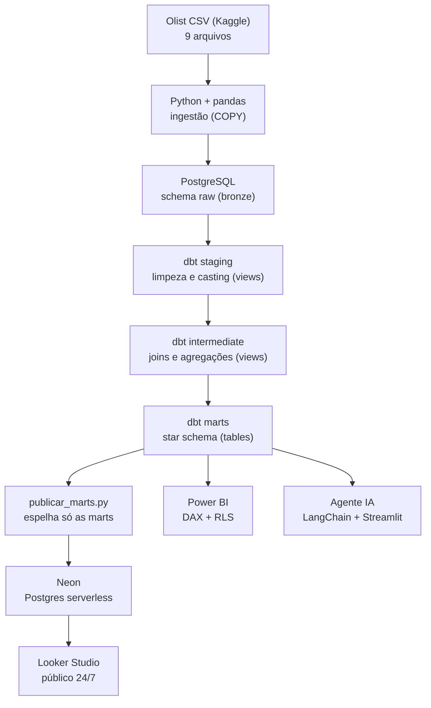
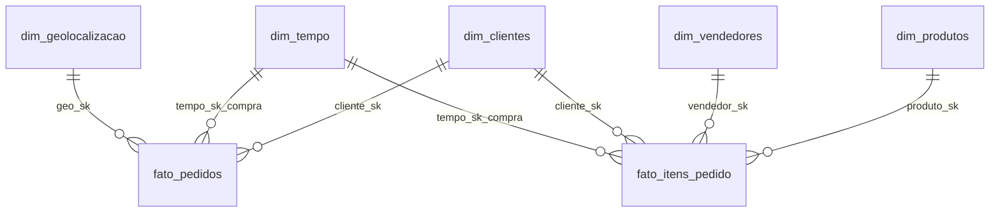
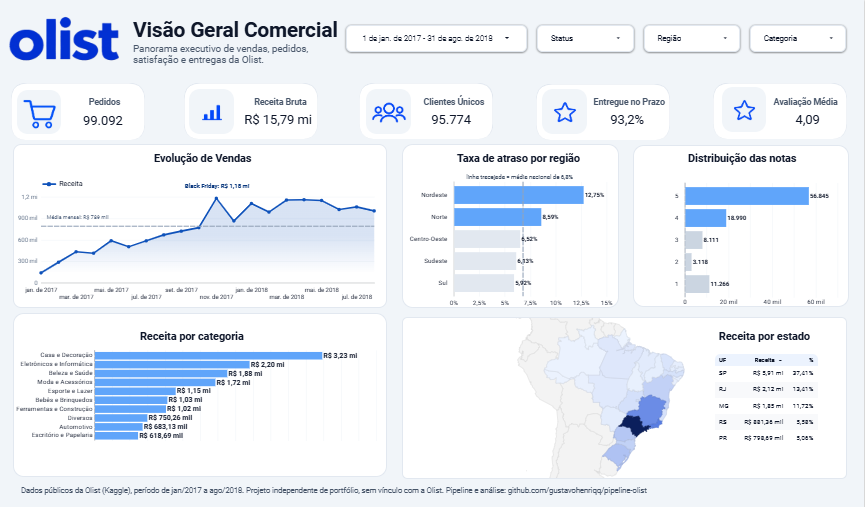

# Atraso na entrega custa R$ 1,15 milhão ao ano

Pipeline de dados de ponta a ponta sobre o e-commerce brasileiro (dataset público
da Olist, 99.441 pedidos reais), construído para responder uma pergunta de
negócio específica e agir sobre ela.

## O achado

Atrasar a entrega em uma semana derruba a nota do cliente de **4,29 para 2,72**.
Atrasar entre 8 e 30 dias derruba para **1,65**.

| Situação da entrega | Pedidos | Nota média |
|---|---|---|
| No prazo | 89.936 | **4,29** |
| Atraso de 1 a 7 dias | 3.672 | 2,72 |
| Atraso de 8 a 30 dias | 2.517 | **1,65** |
| Atraso acima de 30 dias | 345 | 2,06 |

São **6.534 pedidos atrasados, R$ 1.150.892 em receita, 7,3% do total**.

E a leitura óbvia sobre onde agir está errada. O Sudeste concentra 62% dos
atrasos e, como região, tem taxa **abaixo** da média nacional (6,1% contra 6,8%).
Mas olhando estado por estado, o foco aparece: o **Rio de Janeiro sozinho gera
659 atrasos em excesso**, mais que o Nordeste inteiro (537). Ele sumia na visão
por região porque São Paulo, muito maior e com taxa de 4,5%, compensava o RJ
dentro do mesmo balde. **RJ e Nordeste respondem por 86% do atraso em excesso**,
associado a cerca de R$ 224 mil.

> Uma versão anterior deste README dizia que o Nordeste respondia por 94% do
> excesso. A conta estava certa por região e errada como conclusão. O erro
> apareceu quando um mapa por estado pediu um grão mais fino, e está documentado
> na análise.

E a ação intuitiva também está errada. Decompondo o tempo de entrega, **87% do
atraso nasce no transporte e só 13% no vendedor**. Tanto no Nordeste quanto no
RJ, o vendedor despacha **mais rápido** que a média nos pedidos atrasados, e o
transporte é que demora. Cobrar SLA desses vendedores atacaria a parte que já
funciona melhor que a média. A ação é logística, não comercial.

> Análise completa, com o controle por região, a decomposição vendedor contra
> transportadora, a investigação da anomalia da cauda e as queries de
> reprodução: **[docs/analise-atraso.md](docs/analise-atraso.md)**.

## O que o projeto faz com isso

Três frentes atacam a mesma pergunta, e a conexão entre elas é o ponto do
projeto:

| Frente | Papel | Estado |
|---|---|---|
| **Análise** | Quantificar o problema e recomendar ação | Etapa 2 |
| **Engenharia** | Entregar o dado com confiabilidade, todo dia | Etapas 1 e 3 (concluídas) |
| **ML** | Prever o atraso no momento do pedido | Etapa 4 (concluída) |

O ciclo fecha quando a previsão do modelo aparece no mesmo dashboard que a
análise usou para achar o problema. O plano completo, incluindo o que foi
descartado e por quê, está no [ROADMAP.md](ROADMAP.md).

> Status: **Etapas 1 a 4 concluídas** no dataset completo, com o dashboard
> publicado. `dbt build` com 103 nós ok, 3 avisos propositais e 0 erro (22
> models e 84 testes), e cada execução fica registrada no próprio banco. No CI,
> cada PR roda uma vez e constrói só o que mudou; a `main` roda tudo, com a
> validação de idempotência, janela e metadados.

### Confiabilidade (Etapa 3)

- **Freshness da carga:** a ingestão grava `_carregado_em` e `dbt source
  freshness` avisa depois de 24 horas e falha depois de 7 dias.
- **Metadados de execução:** cada comando do dbt e cada model ou teste ficam
  gravados no schema `meta`. O rodapé do dashboard mostra quando o dado foi
  processado e quantos testes passaram.
- **Reprocessamento por janela:** `--vars '{janela_inicio: ..., janela_fim: ...}'`
  troca só as linhas daquele período nos fatos, refletindo inclusive exclusões
  na origem, numa transação.
- **CI enxuto:** `state:modified` contra a branch base; PR só de documentação não
  reconstrói nada.

Detalhes, limites e o que pode dar errado em produção: [docs/confiabilidade.md](docs/confiabilidade.md).

### Previsão de atraso (Etapa 4)

Um gradient boosting treinado só com o que existe no ato da compra (prazo
prometido, geografia, frete, carga, pagamento), com separação temporal, baseline
antes do modelo e limiar escolhido por custo. A previsão volta ao warehouse em
`marts.previsao_atraso`, testada pelo dbt e publicada no Neon junto com as
demais marts.

- No teste (mai a ago/2018), PR-AUC **0,085** contra **0,049** da baseline por UF,
  numa base com 4,4% de atraso. Os 10% de pedidos mais arriscados atrasam 10 vezes
  mais que os 10% menos arriscados.
- **O alerta não se paga no período de teste:** o limiar escolhido num período de
  crise (10,8% de atraso) erra demais num período calmo (4,4%). O documento
  mostra o custo mês a mês e o que faria em produção.
- A validação expôs um erro de desenho: o mês da compra decorava 2017 (o modelo
  perdia até para a baseline, e o PSI da coluna deu 4,92). A feature saiu, e a
  primeira execução continua versionada.
- Com vazamento proposital (`atraso_dias` como feature), o mesmo modelo chega a
  ROC-AUC 1,000: o número que um modelo inútil mostraria.

Resultados, auditoria de features e limites: [docs/modelo-atraso.md](docs/modelo-atraso.md).

Stack: **Python, SQL, dbt, PostgreSQL, Docker, scikit-learn e Power BI.**

---

## 1. Problema de negócio

A Olist conecta pequenos lojistas aos grandes marketplaces do Brasil. Cada venda
gera dados espalhados em várias tabelas (pedidos, itens, pagamentos, avaliações,
clientes, vendedores, geolocalização). Sem um modelo central, cada pergunta de
negócio vira um SQL manual e demorado.

Este pipeline organiza esses dados em um **modelo dimensional (star schema)** que
sustenta tanto o diagnóstico quanto a ação:

- Onde o atraso se concentra, e quanto ele custa em receita e em satisfação?
- Qual região e estado mais vende? Qual o ticket médio por região?
- Quais vendedores e categorias têm melhor desempenho?
- Dá para prever, no ato da compra, que um pedido vai atrasar?

### Números do modelo

| Indicador | Valor |
|---|---|
| Pedidos processados | 99.441 |
| Receita total (itens + frete) | R$ 15,84 milhões |
| Ticket médio por pedido | R$ 159,33 |
| Tempo médio de entrega | 12,5 dias |
| Pedidos entregues no prazo | 93,2% |
| Nota média de avaliação | 4,09 de 5 |
| Estado líder em receita | São Paulo (R$ 5,9 mi) |
| Categoria líder em receita | health_beauty (R$ 1,44 mi) |

Base: dataset completo. O tempo de entrega e o percentual no prazo consideram só
os pedidos já entregues, porque incluir os 2.963 em trânsito contaria como
atrasado um pedido que ainda nem venceu o prazo.

---

## 2. Arquitetura


```mermaid
flowchart TD
    A["Olist CSV (Kaggle)<br/>9 arquivos"] --> B["Python + pandas<br/>ingestão (COPY)"]
    B --> C["PostgreSQL<br/>schema raw (bronze)"]
    C --> D["dbt staging<br/>limpeza e casting (views)"]
    D --> E["dbt intermediate<br/>joins e agregações (views)"]
    E --> F["dbt marts<br/>star schema (tables)"]
    F --> P["publicar_marts.py<br/>espelha só as marts"]
    P --> N["Neon<br/>Postgres serverless"]
    N --> H["Looker Studio<br/>público 24/7"]
    F --> G["Power BI<br/>DAX + RLS"]
    F --> I["Agente IA<br/>LangChain + Streamlit"]
```

O fluxo segue o padrão **Medallion** (bronze / silver / gold), que na fase cloud vira Bronze, Silver e Gold no Databricks:

- **raw (bronze):** dado como veio do CSV, tudo em texto. Nada de transformação aqui. Se algo der errado depois, o bruto continua intacto para reprocessar.
- **staging + intermediate (silver):** limpeza, conversão de tipos, joins e agregações. São views: leves e sempre atualizadas.
- **marts (gold):** o star schema pronto para consumo. São tabelas materializadas, para o BI e o agente responderem rápido.

### Modelo dimensional (marts)

Dois fatos, porque existem dois grãos diferentes:

- **fato_pedidos** (um por pedido): métricas de valor, pagamento, nota e entrega.
- **fato_itens_pedido** (um por item): é onde produto e vendedor se conectam, já que um pedido pode ter vários produtos e vendedores.

Dimensões: `dim_clientes`, `dim_produtos`, `dim_vendedores`, `dim_tempo`, `dim_geolocalizacao`.

Além do star schema, a camada marts tem duas **tabelas largas (OBT, One Big Table)** derivadas dele: `obt_pedidos` (grão de pedido) e `obt_itens` (grão de item). Elas existem porque o Looker Studio trata cada tabela como fonte separada e só junta por "blend", que é limitado. A tabela larga elimina esse atrito no BI. O star schema continua sendo a fonte da verdade: é nele que os testes de integridade referencial rodam e é nele que o Power BI (Etapa 5) e o agente de IA (Etapa 6) vão ligar, porque tanto o VertiPaq quanto o texto-para-SQL trabalham melhor com modelo dimensional.


```mermaid
erDiagram
    dim_clientes ||--o{ fato_pedidos : cliente_sk
    dim_tempo ||--o{ fato_pedidos : tempo_sk_compra
    dim_geolocalizacao ||--o{ fato_pedidos : geo_sk
    dim_produtos ||--o{ fato_itens_pedido : produto_sk
    dim_vendedores ||--o{ fato_itens_pedido : vendedor_sk
    dim_clientes ||--o{ fato_itens_pedido : cliente_sk
    dim_tempo ||--o{ fato_itens_pedido : tempo_sk_compra
```

---

## 3. Stack e o porquê de cada escolha

| Camada | Ferramenta | Por quê |
|---|---|---|
| Ingestão | Python + pandas | Lê CSV bagunçado (vírgulas e quebras de linha nas avaliações) e carrega em massa com `COPY`, muito mais rápido que INSERT. |
| Camada raw | PostgreSQL schema `raw` | O próprio Postgres guarda o bruto, tudo em texto. Volume de 1,5 milhão de linhas não justifica data lake separado. |
| Transformação | dbt (dbt-core) | Padrão de mercado para analytics engineering: SQL versionado, testes de qualidade, documentação e linhagem automática. |
| Armazenamento | PostgreSQL | Banco relacional sólido, gratuito e o que a maioria das vagas pede. |
| Camada de serviço | Neon (Postgres serverless) | Recebe só as marts testadas, para o BI ler 24/7 sem depender da máquina local. |
| BI principal | Power BI (DAX, RLS, OLS) | Padrão de mercado em BI corporativo no Brasil. |
| BI público | Looker Studio | Dashboard online e gratuito, para portfólio 24/7. |
| IA | LangChain + Streamlit | Perguntas em linguagem natural viram SQL sobre o warehouse. |
| Container | Docker + Docker Compose | Sobe o ambiente inteiro com um comando, em qualquer máquina. |

---

## 4. Como rodar localmente

Pré-requisitos: **Docker Desktop** e **Python 3.11+**.

```bash
# 1. Clonar e entrar na pasta
git clone https://github.com/gustavohenriqq/pipeline-olist.git
cd pipeline-olist

# 2. Configurar variáveis (copie o exemplo e ajuste se quiser)
cp .env.example .env

# 3. Baixar o dataset do Kaggle e colocar os 9 CSVs em data/raw/
#    (Brazilian E-Commerce Public Dataset by Olist)

# 4. Instalar as dependências Python (recomendado num ambiente virtual)
python -m venv .venv
source .venv/bin/activate          # Windows: .venv\Scripts\activate
pip install -r requirements.txt

# 5. Subir o Postgres (e o pgAdmin em http://localhost:8080)
docker compose up -d

# 6. Rodar tudo de uma vez: ingestão + dbt build (models + testes)
make pipeline

# 7. Opcional: publicar as marts no Neon para o Looker Studio ler
#    (preencha antes o bloco NEON_* do .env)
make publicar
```

> **Windows.** Se o `dbt` na linha de comando for bloqueado pela política de
> Controle de Aplicativo, chame o módulo em vez do executável:
> `python -m dbt.cli.main build --profiles-dir .`. É o mesmo programa, sem o
> atalho `.exe` que a política barra.

### Rodar rápido, sem baixar o Kaggle (amostra)

O repositório já traz uma amostra pequena e coerente em `data/sample/` (800 pedidos, chaves preservadas). Dá para rodar o pipeline inteiro só com ela:

```bash
docker compose up -d
OLIST_DATA_DIR=data/sample python ingestion/ingest.py
cd dbt && dbt build --profiles-dir .
```

É o que o CI (GitHub Actions) roda: no PR, só os models que mudaram; na `main`, tudo. Para o dataset completo, use `data/raw/` como abaixo.

### Passo a passo manual

Sem `make` (Windows puro), rode na ordem:

```bash
docker compose up -d
python ingestion/ingest.py
cd dbt
dbt source freshness --profiles-dir .   # idade da carga
dbt run  --profiles-dir .
dbt test --profiles-dir .
cd ..
python scripts/publicar_marts.py   # opcional: espelha as marts no Neon
```

Para ver a documentação e a linhagem do dbt no navegador:

```bash
cd dbt
dbt docs generate --profiles-dir .
dbt docs serve    --profiles-dir . --port 8081
```

### O que o pipeline entrega ao final

- Schema `raw`: 9 tabelas cruas.
- Schema `staging` e `intermediate`: views de limpeza e agregação.
- Schema `marts`: 5 dimensões + 2 fatos + 2 tabelas largas (OBT), prontos para BI.
- Testes de qualidade dbt (unicidade, não nulo, valores aceitos, integridade referencial e range): 74 na fundação, mais os do modelo de atraso.
- Rótulos em português gerados no dbt: status do pedido, situação (entregue, em andamento, não concluído) e categoria em 14 grupos comerciais.
- Schema `meta`: histórico de cada execução do dbt e do resultado de cada model e teste.
- `marts.atualizacao_dados`: quando o dado foi processado, para o rodapé do dashboard.
- Camada de serviço no Neon com as marts publicadas, para o Looker Studio ler 24/7.

---

## 5. Estrutura do repositório

```
pipeline-olist/
├── data/raw/                 # CSVs do Kaggle (ignorados no Git)
├── ingestion/                # ingestão Python + pandas
│   ├── config.py             # conexão e mapeamento CSV -> tabela
│   └── ingest.py             # carga em massa via COPY
├── dbt/                      # projeto dbt
│   ├── models/
│   │   ├── staging/          # limpeza e casting (views)
│   │   ├── intermediate/     # joins e agregações (views)
│   │   ├── marts/            # star schema (tables)
│   │   └── ml/               # features do modelo de atraso (lista permitida)
│   ├── macros/               # helpers próprios (surrogate key, calendário, região, rótulos, testes)
│   ├── tests/                # testes singulares
│   ├── dbt_project.yml
│   └── profiles.yml
├── ml/                       # treino, avaliação e inferência do modelo de atraso
│   └── artefatos/            # metricas.json versionado (modelo.joblib fora do Git)
├── tests/                    # testes Python do modelo (pytest)
├── scripts/                  # gerar_amostra.py, publicar_marts.py
├── dashboards/               # guia do Looker Studio e notas de Power BI
├── docs/                     # diagramas e decisões
├── docker-compose.yml        # Postgres + pgAdmin
├── Makefile                  # atalhos (make pipeline, make dbt-run, ...)
├── requirements.txt
├── requirements-ml.txt       # dependências do modelo (scikit-learn, pytest)
└── ROADMAP.md                # plano por etapas e decisões descartadas
```

---

## 6. Decisões técnicas (o porquê, não só o como)

**Raw em texto puro.** A camada raw guarda tudo como TEXT e não converte nada. O casting fica no staging do dbt, versionado no Git. Assim, mudar uma regra de conversão é uma alteração rastreável, e o dado bruto nunca é perdido.

**COPY em vez de INSERT linha a linha.** A tabela de geolocalização tem 1 milhão de linhas. `df.to_sql` seria lento demais. O `COPY` nativo do Postgres carrega tudo em segundos.

**Cliente no grão de pessoa.** Na base do Olist, `customer_id` muda a cada pedido. Quem identifica a pessoa é o `customer_unique_id`. A `dim_clientes` usa a pessoa, senão a contagem de clientes ficaria inflada.

**Dois fatos, dois grãos.** Não dá para colocar produto e vendedor no fato de pedido, porque um pedido tem vários. Por isso existe o `fato_itens_pedido` no grão de item. Esse é o jeito certo de star schema quando há grãos diferentes.

**Sem dependência de pacote externo no dbt.** Em vez do `dbt_utils`, o projeto traz macros próprias (surrogate key, calendário, testes). Assim ele roda em qualquer ambiente, mesmo sem acesso ao hub do dbt. A troca pelo `dbt_utils` é simples se um dia for desejada.

**Testes desde o início.** Qualidade de dado não é opcional. Cada modelo tem testes de unicidade, não nulo, valores aceitos e integridade referencial. O pipeline só é confiável se os testes passam.

### O que pode dar problema em produção real

- **Schemas fixos (`staging`, `marts`).** Ótimo local, mas num warehouse compartilhado por vários devs isso causa colisão. Em produção, o padrão `<ambiente>_<schema>` (comportamento default do dbt) é mais seguro.
- **Geolocalização incompleta.** 278 CEPs de cliente não existem na base de geolocalização. O teste de integridade está como **aviso**, não erro, de propósito. Em produção, decidir: enriquecer com outra fonte de CEP ou aceitar o gap.
- **Incrementalidade parcial.** Os dois fatos escrevem apenas linhas novas ou alteradas, com idempotência validada no CI. A ingestão raw, dimensões e OBTs continuam full; os fatos ainda leem o resultado inteiro para detectar correções antigas sem `updated_at`. Exclusões da origem pedem `--full-refresh` ou o reprocessamento da janela afetada. Ver [incrementalidade](docs/incrementalidade.md) e [confiabilidade](docs/confiabilidade.md).
- **Segredos.** O `.env` nunca vai para o Git. Em produção, usar um cofre de segredos (Azure Key Vault, AWS Secrets Manager).

---

## 7. Dashboards

O Looker Studio precisa alcançar o banco pela internet, e um Postgres em `localhost` só responde enquanto a máquina está ligada. Por isso as marts são espelhadas no **Neon**, um Postgres serverless gratuito, que funciona como camada de serviço do BI:

```bash
cd dbt && dbt build --profiles-dir . && cd ..   # constrói e testa local
python scripts/publicar_marts.py                # espelha as marts no Neon
```

**Sobe só a camada marts, nunca a raw.** O free tier do Neon dá 0,5 GB e a tabela crua `geolocation` sozinha tem 1 milhão de linhas. Com apenas as marts, o banco na nuvem ocupa 147 MB (cerca de 29% do limite). Esse também é o desenho correto em produção: ferramenta de BI nunca lê a camada crua, lê o modelo já testado. Nada é publicado sem antes passar nos testes do dbt.

O passo a passo completo de conexão, as páginas sugeridas e os números de conferência estão em [dashboards/README.md](dashboards/README.md).

- **Looker Studio (público):** **[Visão Geral Comercial](https://datastudio.google.com/reporting/f66379d8-5fd9-4d0c-8e9c-4cd7019db7c7)**. Cards, evolução de vendas, taxa de atraso por região, receita por categoria, distribuição das notas e mapa de receita por estado, todos conferidos contra o banco. A configuração de cada componente e as armadilhas do Looker encontradas no caminho estão em [dashboards/README.md](dashboards/README.md).
- **Power BI (Etapa 5):** dashboard executivo com DAX avançado, RLS por região e vendedor e OLS para métricas sensíveis. Ali o consumo é do star schema, não das OBTs.

[](https://datastudio.google.com/reporting/f66379d8-5fd9-4d0c-8e9c-4cd7019db7c7)

*Página inicial do relatório, janela de jan/2017 a ago/2018. Clique na imagem para abrir a versão interativa.*

---

## 8. Próximos passos

O plano completo, com as decisões descartadas e a evidência por trás de cada
uma, está no [ROADMAP.md](ROADMAP.md). Resumo:

1. **Fundação** (concluída, com o dashboard publicado): ingestão, Postgres, dbt, 74 testes e camada de serviço no Neon.
2. **Análise do atraso** (concluída): documento com recomendação e número, investigando por que a curva de nota não é monótona.
3. **Confiabilidade no dbt** (concluída): models incrementais, idempotência, reprocessamento por janela, freshness, metadados de execução e CI enxuto. Detalhes em [docs/confiabilidade.md](docs/confiabilidade.md).
4. **Previsão de atraso** (concluída): classificador treinado só com informação disponível no ato da compra, com inferência escrita de volta nas marts. Resultados em [docs/modelo-atraso.md](docs/modelo-atraso.md).
5. **Power BI avançado:** DAX, RLS por região e vendedor, OLS.
6. **Agente de IA** (opcional): LangChain sobre as marts, com usuário somente leitura.

Três mudanças de rota, todas por evidência nos dados:

- **PySpark foi cortado.** 1,5 milhão de linhas roda em 23 segundos num Postgres em container. Volume não justifica computação distribuída.
- **Airflow saiu deste projeto.** Fonte estática não tem o que agendar, e orquestração sem necessidade real vira enfeite.
- **Previsão de demanda virou previsão de atraso.** A série tem 20 meses úteis, 1,7 ciclo anual. Não dá para validar sazonalidade com menos de dois ciclos.

### O que este projeto não demonstra

Não há ingestão de fonte viva (é um dump estático de CSV), nem escala real, nem
streaming. Essas competências pedem um projeto de forma diferente, com dado
coletado ao longo do tempo de uma fonte que muda. É a lacuna consciente deste
repositório.

---

## Sobre

Projeto de portfólio de **Gustavo Henrique Silva Nascimento**, estudante de Ciência da Computação e profissional de dados, focado na trajetória Analista de Dados, Analytics Engineer e Engenharia de Dados.

GitHub: [@gustavohenriqq](https://github.com/gustavohenriqq) · Dataset: [Brazilian E-Commerce Public Dataset by Olist (Kaggle)](https://www.kaggle.com/datasets/olistbr/brazilian-ecommerce)
