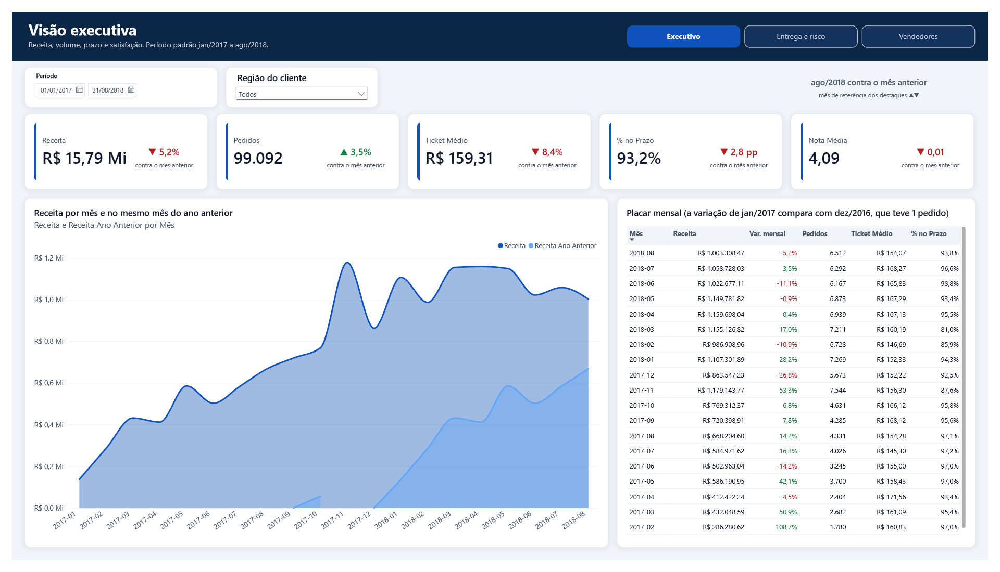

# Power BI: relatório executivo (Etapa 5)

Relatório em três páginas sobre o star schema das marts, com DAX de inteligência
de tempo, RLS dinâmico por região e por vendedor e OLS sobre os dados do cliente.
Tudo versionado em texto: o modelo em **TMDL** e o relatório em **PBIR**, dentro de
um projeto **PBIP**. Nada é publicado no Power BI Service; o PDF e os prints estão
em `docs/prints/`.



| Página | O que mostra |
|---|---|
| [Visão executiva](../../docs/prints/powerbi-executivo.png) | receita, pedidos, ticket médio, % no prazo e nota; receita por mês contra o mesmo mês do ano anterior; variação mensal |
| [Entrega e risco](../../docs/prints/powerbi-entrega-risco.png) | taxa de atraso por região contra a nacional; atraso em excesso por UF (RJ no topo); pedidos em andamento por probabilidade de atraso; pedidos em alerta e receita em risco |
| [Vendedores](../../docs/prints/powerbi-vendedores.png) | receita de itens por grupo de categoria e por vendedor, com a taxa de atraso de cada um. É a página do perfil Vendedor |

PDF com as três páginas: [docs/prints/powerbi-olist.pdf](../../docs/prints/powerbi-olist.pdf).

## Como abrir

Pré-requisitos: Power BI Desktop (testado na versão 2.158 da Microsoft Store) e o
Postgres local com as marts construídas (`dbt build`, que também carrega o seed
de segurança).

1. Abra `Olist.pbip`.
2. Na primeira atualização o Desktop pede a credencial do Postgres: escolha
   **Banco de dados** e use o usuário e a senha do `.env`. A credencial fica nas
   configurações do Desktop, nunca no projeto.
3. O Desktop avisa que a conexão não é criptografada. Aceite **só para o
   `localhost`**: o Postgres do Docker não tem SSL configurado e o tráfego não sai
   da máquina.
4. **Atualizar.** A carga leva uns 3 minutos (cerca de 440 mil linhas em oito
   tabelas). Depois disso o cache (`.pbi/cache.abf`, fora do Git) abre o modelo
   sem nova carga.

**Para ligar no Neon**, troque os parâmetros `ServidorPostgres` e `BancoPostgres`
(Transformar dados > Gerenciar parâmetros). Lá a conexão criptografada é
obrigatória: não aceite o aviso de conexão sem criptografia.

## Estrutura

```
Olist.pbip
Olist.SemanticModel/definition/   modelo em TMDL
  expressions.tmdl                parâmetros de conexão
  tables/                         uma tabela por arquivo (Import, Power Query)
  relationships.tmdl              7 relações, todas um para muitos
  roles/                          papéis de RLS e OLS
Olist.Report/definition/          relatório em PBIR (páginas e visuais em JSON)
Olist.Report/StaticResources/     tema nas cores do dashboard do Looker
conferencia/                      teste automático do modelo contra o SQL
```

## Modelo

Import, lendo só as tabelas de `marts` que o relatório usa: `fato_pedidos` e
`fato_itens_pedido` (dois grãos), as dimensões de cliente, produto, vendedor e
tempo, `previsao_atraso` (Etapa 4) e `seguranca_bi` (oculta). As OBTs ficam de fora:
elas existem porque o Looker só junta fontes por blend, e o VertiPaq trabalha
melhor com o star schema.

Não existe relação entre os dois fatos. Produto e vendedor só existem no grão de
item, e é o RLS do Vendedor que leva o filtro de itens para os pedidos (ver
Segurança).

## Medidas

21 medidas na tabela `_Medidas`, em pastas: Vendas, Tempo, Entrega, Satisfação,
Risco e Vendedores. Cada uma tem descrição no próprio modelo. Três pontos que
valem a leitura:

- **`Atrasos` usa `==`, não `=`.** Em DAX, `BLANK() = FALSE()` é verdadeiro: com `=`,
  os 2.965 pedidos sem entrega entravam como atraso (9.500 em vez de 6.535), e o %
  no prazo caía de 93,2% para 90,2%. A conferência pegou na primeira execução.
- **`Taxa Nacional de Atraso`** tira o filtro de cliente com `REMOVEFILTERS`, e
  `Atraso em Excesso` compara cada recorte com ela. O RJ fica em +659, o mesmo
  número da análise da Etapa 2.
- **`Variação Mensal %`** de jan/2017 dá +69.127,8%: dez/2016 teve um único pedido
  (R$ 19,62). O número é real e o título da tabela explica. Uma versão que
  deixava em branco o mês cujo anterior está fora do período foi descartada: com
  um único mês selecionado, ela apagava a variação daquele mês.

As medidas de risco (`Pedidos em Alerta`, `Receita em Risco`) só contam os
conjuntos `teste` e `em_andamento`, porque as previsões sobre treino e validação
são otimistas.

## Segurança

**RLS dinâmico.** Os usuários estão em `seguranca_bi`, um seed do dbt
(`dbt/seeds/seguranca_bi.csv`) com e-mails fictícios em `@exemplo.com.br`. Cada
papel filtra pela linha do próprio usuário (`USERPRINCIPALNAME()`):

| Papel | O que vê |
|---|---|
| Diretoria | tudo |
| Gerente regional | clientes das regiões do usuário, e os pedidos e itens deles |
| Vendedor | os próprios itens e os pedidos que têm item dele |

Incluir alguém é uma linha nova no seed: quem administra acesso não mexe no
modelo, e um papel por região ou por vendedor não precisa existir. Um e-mail fora
do seed, nos papéis Gerente regional e Vendedor, não vê nada.

**OLS.** No papel Vendedor, `customer_unique_id`, `zip_code_prefix` e `cidade` de
`dim_clientes` ficam com permissão `none`. O vendedor vê quanto vendeu e para qual
UF, não quem comprou. Nenhuma medida depende dessas colunas, e todas as 21 foram
avaliadas no papel Vendedor sem erro.

**Duas consequências registradas:**

- **RLS e taxa nacional.** `REMOVEFILTERS` não atravessa o RLS. Para um gerente
  regional, a "taxa nacional" vira a taxa da região dele, e o atraso em excesso
  tende a zero. É o comportamento certo (ele não pode ver o resto do país), e
  mostra por que medida comparativa precisa ser pensada junto com a segurança.
- **Pedidos com mais de um vendedor.** 1.278 pedidos (1,3%) têm itens de vendedores
  diferentes. No papel Vendedor, a receita desses pedidos aparece inteira nas
  medidas de `fato_pedidos`. As medidas de item são as exatas, e a página
  Vendedores usa só elas.

## Conferência

O teste automático fica em [conferencia/](conferencia/): consulta o modelo aberto
por DAX e compara com o mesmo número calculado em SQL.

| Grupo | Casos | Resultado |
|---|---|---|
| Linhas de cada tabela | 8 | iguais ao banco |
| Medidas (receita, ticket, % no prazo, nota, excesso do RJ, acumulado de 2018, variações, risco) | 11 | iguais até o centavo |
| Papéis (usuário fora do seed e OLS) | 8 | ok nos três papéis |
| Usuários do seed, pelo "Exibir como" | 6 | iguais ao SQL |

O motor local do Desktop não aceita personificar um e-mail que não é conta do
Windows, então os usuários do seed são conferidos pelo "Exibir como". O
procedimento e os números estão no [README da conferência](conferencia/README.md).

O relatório abre com a janela de jan/2017 a ago/2018, a mesma do Looker, e nela
os cartões mostram 99.092 pedidos e R$ 15,79 mi, conferidos contra o SQL da
janela. Sem a janela, os totais são os da conferência: 99.441 pedidos e
R$ 15,84 mi.

## Armadilhas encontradas

- **Salvar no Desktop sobrescreve o TMDL** com o que está na memória. Editou um
  arquivo por fora? Use **Apply external changes** na barra que o Desktop mostra,
  nunca salve antes.
- **O Desktop reescreve tipos ao salvar.** As colunas de valor, que o Power Query
  não tipava, viraram `double`. A conferência passa no centavo, mas o certo para
  dinheiro é tipar como moeda (`Currency.Type`) no M.
- **Exportar PDF sob "Exibir como"** gera uma imagem cortada da tela. Os prints
  saem do PDF exportado sem papel nenhum.
